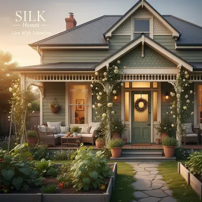

# Article Completeness Instructions v2.3

## Quick Start for Agents

**Essential files to read before starting:**

| File | Purpose | Required |
|------|---------|----------|
| `article_catalog.csv` | Master tracking spreadsheet (49 columns) | **YES** |
| `CHARACTERS.md` | 50 community members - validate authors against this | **YES** |
| `articles/yoga-beginners/index.html` | **GOLD STANDARD** - THE template to follow | **YES** |
| `banner_ad_instructions.md` | How to create 21:9 banner ads with empty top half | **YES** |
| This file | Instructions and HTML patterns | **YES** |

### CRITICAL: The Gold Standard

**The ONLY template to use is: `articles/yoga-beginners/index.html`**

This is the Enhanced Article Format with:
- Directory-based structure (`articles/[slug]/index.html`)
- Self-contained `media/` folder for images
- Proper sidebar containment (all sidebar content INSIDE `column_1_3`)
- Real WebP images (no `.jpg` placeholders)
- 100x100 comment avatars with `-thumb.webp` suffix
- No search form in header top bar
- All enhanced features (newsletter, sticky sidebar, mobile ad)

**DO NOT use `post-*.html` files as templates** - these are legacy format.

**Key paths:**
- Enhanced articles: `/mnt/d/silk/silklife/articles/[slug]/index.html`
- Legacy articles: `/mnt/d/silk/silklife/post-*.html`
- Avatars: `/mnt/d/silk/silklife/images/avatars/`
- Sidebar ads: `/mnt/d/silk/silklife/images/ads/sidebar/`
- Banner ads: `/mnt/d/silk/silklife/images/ads/banner/`

### CRITICAL: HTML Structure Validation

**Before saving ANY article, verify this structure:**

```html
<div class="row page_margin_top article-layout">
    <div class="column column_2_3">
        <!-- ALL article content here -->
        <!-- Author box, share, tags, related, comments, form -->
    </div>
    <div class="column column_1_3">
        <!-- ALL sidebar content here -->
        <!-- Newsletter, tabs, "More in Category", sidebar ads, quotes, popular articles -->
        <!-- EVERYTHING stays INSIDE this div -->
    </div>
</div>  <!-- article-layout closes AFTER both columns -->
```

**Common Mistake to Avoid:**
```html
<!-- WRONG - sidebar content escaping the column -->
    </div>  <!-- column_1_3 closes too early -->
</div>  <!-- article-layout closes -->
    <div class="row">  <!-- ORPHANED! This should be INSIDE column_1_3 -->
```

**Validation Checklist:**
1. Count opening `<div class="column column_1_3">` tags
2. Count closing `</div>` tags before `</div><!-- article-layout -->`
3. They must match - all sidebar content MUST be inside `column_1_3`
4. Use an HTML validator or browser DevTools to check nesting

### Common Mistakes to Avoid (From Agent Audits)

These issues were found by comparing articles against the gold standard:

#### 1. Broken Image Paths
```html
<!-- WRONG -->


<!-- CORRECT -->

```
Always include the `/shared/` subdirectory for shared network banners.

#### 2. Extra "SHOW MORE" Buttons in Tabs
The gold standard does NOT have "SHOW MORE" links in sidebar tabs. Remove them:
```html
<!-- REMOVE THIS -->
<a class="more page_margin_top" href="#">SHOW MORE</a>
```

#### 3. Sidebar Ad Label Position
```html
<!-- WRONG - label after image -->
<div class="sidebar-ad page_margin_top">
    <a href="..."></a>
    <p>Advertisement</p>
</div>

<!-- CORRECT - label before image, with text-align -->
<div class="sidebar-ad page_margin_top" style="text-align: center;">
    <p style="font-size: 10px; color: #718096; margin-bottom: 5px;">Advertisement</p>
    <a href="..."></a>
</div>
```

#### 4. Comment Form Pre-filled Values
```html
<!-- WRONG - causes double text -->
<input type="text" value="Your Name *" placeholder="Your Name *">
<form action="post-filename.html">

<!-- CORRECT -->
<input type="text" placeholder="Your Name *">
<form action="">
```

#### 5. Comment Avatar CSS Specificity
Add strong specificity to override default placeholder backgrounds:
```css
#comments_list .comment_author_avatar {
    background: none !important;
    background-image: none !important;
}
#comments_list li.comment .comment_author_avatar {
    background: none !important;
    background-image: none !important;
}
#comments_list .comment_author_avatar img {
    display: block;
    width: 100%;
    height: 100%;
    object-fit: cover;
    border-radius: 50%;
}
```

#### 6. Orphaned Closing Tags
After editing, verify proper div nesting at end of article:
```html
<!-- CORRECT ending structure -->
                        </div>  <!-- closes last sidebar element -->
                    </div>  <!-- closes column_1_3 -->
                </div>  <!-- closes article-layout row -->
            </div>  <!-- closes page_layout -->
        </div>  <!-- closes page -->
        <div class="footer_container">
```

#### 7. Single-Quote Image Paths Not Converted
When migrating articles, BOTH single and double-quoted paths must be updated:
```html
<!-- WRONG - missed single quotes during migration -->


<!-- CORRECT - all paths need ../../ prefix -->

```

**Migration command must handle both quote styles:**
```bash
sed -e "s|src='images/|src='../../images/|g" \
    -e 's|src="images/|src="../../images/|g' \
    -e "s|href='images/|href='../../images/|g" \
    -e 's|href="images/|href="../../images/|g' \
    post-article.html > articles/slug/index.html
```

#### 8. Author Photo Size (CRITICAL)
**Author photos MUST be actual 100x100 images, NOT scaled-down 1024x1024 images.**

```html
<!-- WRONG - using full-size image -->

<!-- This is 1024x1024 (133KB) - too large, browser scales it down -->

<!-- CORRECT - using thumbnail image -->

<!-- This is actual 100x100 (2KB) - proper size for author box -->
```

**Avatar naming convention:**
- Full-size (1024x1024): `[name].webp` - for hero images if needed
- Thumbnail (100x100): `[name]-thumb.webp` - **USE THIS for author box and comments**

**To create a 100x100 thumbnail:**
```bash
# Using ImageMagick
convert sarah-mitchell.webp -resize 100x100 sarah-mitchell-thumb.webp

# Using cwebp with ImageMagick
convert sarah-mitchell.webp -resize 100x100 PNG:- | cwebp -q 90 -o sarah-mitchell-thumb.webp -- -
```

---

## Objective
Achieve a **100% completeness rating** on every article in the SILK Life magazine with proper separation of concerns, unique ad assets per article, and enhanced engagement features.

---

## Enhanced Article Format (v2 Structure)

The **Enhanced Article Format** is the new gold standard for SILK Life articles. See `articles/yoga-beginners/index.html` for reference.

### Key Differences from Legacy Format

| Feature | Legacy (`post-*.html`) | Enhanced (`articles/[slug]/`) |
|---------|------------------------|-------------------------------|
| **Location** | Root directory | `articles/[slug]/index.html` |
| **Media** | `images/articles/` | Self-contained `media/` subfolder |
| **Photos** | 1-2 photos | 4+ photos with `<figure>` captions |
| **Read More** | None or basic | Full intro/expand pattern |
| **Sidebar** | Static | Bidirectional sticky |
| **Newsletter** | None | Top of sidebar |
| **Mobile Ad** | None | Sticky bottom bar |
| **Responsive CSS** | External only | Inline enhancements |
| **Header Banner** | Placeholder "728 x 90" | Real SILK network banner |
| **Author Avatar** | Placeholder sample | Real `images/avatars/[name].webp` |
| **Comment Avatars** | Empty or placeholder | Real `images/avatars/[name]-thumb.webp` |
| **Sidebar Ad** | Shared banner | Unique `images/ads/sidebar/[slug]-sidebar.webp` |
| **Banner Ad** | None | Unique `images/ads/banner/[slug]-banner.webp` |

### Enhanced Article Directory Structure
```
articles/
└── yoga-beginners/
    ├── index.html              # Full article HTML
    └── media/
        ├── hero.webp           # Hero image (1024x683)
        ├── photo-01.webp       # In-article photo 1
        ├── photo-02.webp       # In-article photo 2
        └── photo-03.webp       # In-article photo 3
```

### Required Components for Enhanced Format

1. **Self-Contained Media Folder**
   - All article images in `media/` subfolder
   - Relative paths: `media/hero.webp`
   - Naming: descriptive (e.g., `downward-dog.webp`, `morning-practice.webp`)

2. **Photo Requirements (4+ minimum)**
   - Hero image with prettyPhoto lightbox
   - 3+ in-article photos with `<figure>` and `<figcaption>`
   - Photos placed naturally between paragraphs

3. **Read More Feature**
   - `article-intro` div (first ~40% of content)
   - `read-more-container` with styled button
   - `article-full-content` div (remaining ~60%, initially hidden)

4. **Newsletter Signup**
   - Dark gradient box at top of sidebar
   - Email input + subscribe button
   - Subscriber count ("Join 2,400+ readers")

5. **Mobile Sticky Ad**
   - Fixed position at bottom on mobile
   - Close button with touch handler
   - Compact ad preview with CTA

6. **Bidirectional Sticky Sidebar**
   - JavaScript-controlled sticky behavior
   - Follows user scroll in both directions
   - Stops at article content boundaries

7. **Responsive CSS (Inline)**
   - Flexbox article layout overrides
   - Mobile-first breakpoints
   - Comment/form stacking on mobile

---

## File Organization Structure

### Directory Hierarchy (Separation of Concerns)
```
/mnt/d/silk/silklife/
├── images/
│   ├── ads/
│   │   ├── sidebar/              # Block-style sidebar ads (300x250 or 300x600)
│   │   │   └── [article-slug]-sidebar.webp
│   │   ├── banner/               # Horizontal banner ads (728x90 or 468x60)
│   │   │   └── [article-slug]-banner.webp
│   │   └── shared/               # Shared SILK network promo banners (existing)
│   │       ├── silk-yoga-banner.webp
│   │       ├── silk-arts-banner.webp
│   │       ├── silk-cafe-banner.webp
│   │       ├── silk-homes-banner.webp
│   │       ├── silk-tech-banner.webp
│   │       └── silk-corp-banner.webp
│   ├── articles/                 # Article hero/feature images
│   │   └── [category]-[topic].webp
│   ├── homepage/                 # Homepage-specific images
│   │   ├── carousels/           # Carousel banner images (510x187)
│   │   └── thumbs/              # Thumbnail grid images (330x242, 330x330)
│   ├── avatars/                  # Author/commenter profile images
│   │   └── [character-name].webp
│   └── samples/                  # Placeholder images (to be replaced)
├── posts/                        # Future: Move all post-*.html here
└── article_catalog.csv           # Master tracking spreadsheet
```

### Image Size Standards

| Type | Dimensions | Format | Location |
|------|------------|--------|----------|
| Article Hero | 1024x683 | WebP | `images/articles/` |
| Thumbnail | 330x242 | WebP | `images/homepage/thumbs/` |
| Sidebar Ad (Block) | 300x250 or 300x600 | WebP | `images/ads/sidebar/` |
| Banner Ad (Inline) | 728x90 or 468x60 | WebP | `images/ads/banner/` |
| Carousel | 510x187 | WebP | `images/homepage/carousels/` |
| Avatar | 100x100 | WebP | `images/avatars/` |

---

## CSV Schema (article_catalog.csv)

### Column Definitions

| Column | Type | Description |
|--------|------|-------------|
| **Identity** | | |
| `filename` | string | Article HTML filename (e.g., `post-yoga-beginners.html`) |
| `slug` | string | URL-friendly identifier (e.g., `yoga-beginners`) |
| `title` | string | Article headline |
| `category` | enum | YOGA, ARTS, CAFE, HOMES, TECH, COMMUNITY, GENERAL, WELLNESS |
| `publish_date` | string | Publication date and time |
| **Content** | | |
| `word_count` | int | Total word count of article body |
| `intro_word_count` | int | Words before "read more" button |
| `meta_description` | string | SEO meta description (150-160 chars) |
| `tags` | string | Pipe-delimited tags (e.g., `YOGA\|BEGINNERS\|HOME PRACTICE`) |
| **Authorship** | | |
| `author` | string | Primary author from CHARACTERS.md |
| `author_valid` | boolean | True if author exists in CHARACTERS.md |
| `community_members` | string | Pipe-delimited character names mentioned |
| **Images** | | |
| `hero_image` | string | Path to main article image |
| `thumbnail_link` | string | Path to thumbnail for lists/cards |
| `photo_links` | string | Pipe-delimited list of all images used |
| `photo_count` | int | Number of unique photos in article (excluding ads) |
| **Ads - Unique Per Article** | | |
| `sidebar_ad_image` | string | Path to unique sidebar ad (`images/ads/sidebar/[slug]-sidebar.webp`) |
| `sidebar_ad_generated` | boolean | True if unique ad has been generated |
| `sidebar_ad_placement_verified` | boolean | True if ad is in correct `column_1_3` container |
| `banner_ad_image` | string | Path to unique banner ad (`images/ads/banner/[slug]-banner.webp`) |
| `banner_ad_generated` | boolean | True if unique banner has been generated |
| `banner_ad_style` | enum | `728x90` or `468x60` |
| **Structure** | | |
| `header_complete` | boolean | Full header with top bar, menu, nav |
| `footer_complete` | boolean | Full footer with SILK network links |
| `sidebar_complete` | boolean | Sidebar with related articles, quotes, popular posts |
| `sidebar_in_correct_column` | boolean | Sidebar content is in `column_1_3` not `column_2_3` |
| **Read More Feature** | | |
| `has_read_more_button` | boolean | Article has expandable intro section |
| `read_more_percentage` | int | Percentage shown before expand (30-50) |
| `read_more_implemented` | boolean | Feature is working correctly |
| **Engagement** | | |
| `displayed_comment_count` | int | Number shown in UI (e.g., "18 Comments") |
| `actual_comment_count` | int | Actual `<li class="comment">` elements in HTML |
| `comment_count_matches` | boolean | displayed == actual |
| `view_count` | int | Display view count |
| **Completeness** | | |
| `template_type` | enum | `full`, `partial`, `minimal` |
| `completeness_score` | int | 0-100 calculated score |
| `issues` | string | Pipe-delimited list of remaining issues |
| `last_updated` | string | Timestamp of last agent update |
| **Duplicate Detection** | | |
| `is_duplicate` | boolean | True if article content duplicates another |
| `duplicate_of` | string | Filename of original article (if duplicate) |
| **Placeholder Images** | | |
| `uses_placeholder_images` | boolean | True if any images use `images/samples/` paths |
| `hero_image_is_placeholder` | boolean | True if hero image is a placeholder |
| `hero_image_generated` | boolean | True if unique hero image has been generated |
| **Author Avatar** | | |
| `author_avatar_path` | string | Expected path: `images/avatars/[author-slug].webp` |
| `author_avatar_exists` | boolean | True if avatar file exists |
| **Author Profile Match** | | |
| `author_name_match` | boolean | True if author box name matches `author` field |
| `author_photo_match` | boolean | True if author box photo matches `author_avatar_path` |
| **Header Banner** | | |
| `header_banner_implemented` | boolean | True if 728x90 header slot has real banner |
| **Tag Quality** | | |
| `tags_standardized` | boolean | True if: all uppercase, 3-5 tags, no duplicates |
| `tag_count` | int | Number of tags |
| **View Count Quality** | | |
| `view_count_realistic` | boolean | True if views are realistic for age/category |
| **Enhanced Format (v2)** | | |
| `is_enhanced_format` | boolean | True if article uses directory-based structure (`articles/[slug]/`) |
| `has_media_folder` | boolean | True if article has self-contained `media/` subfolder |
| `media_folder_path` | string | Path to media folder (e.g., `articles/yoga-beginners/media/`) |
| `has_figure_captions` | boolean | True if photos use `<figure>` with `<figcaption>` |
| `has_newsletter_signup` | boolean | True if sidebar has newsletter signup box |
| `has_mobile_sticky_ad` | boolean | True if mobile sticky ad is implemented |
| `has_sticky_sidebar` | boolean | True if bidirectional sticky sidebar JS is present |
| `has_article_layout_class` | boolean | True if row has `article-layout` class for flexbox |
| `has_inline_responsive_css` | boolean | True if article has inline responsive CSS enhancements |
| `comment_avatars_real` | boolean | True if comment avatars use real images (not empty/placeholder) |
| `enhanced_format_score` | int | 0-100 score for enhanced format compliance |
| **508 Accessibility Compliance** | | |
| `has_alt_text_all_images` | boolean | True if ALL images have descriptive alt text |
| `has_proper_heading_hierarchy` | boolean | True if headings follow h1→h2→h3 order (no skipping) |
| `has_descriptive_link_text` | boolean | True if no "click here" or "read more" as sole link text |
| `has_form_labels` | boolean | True if all form inputs have associated labels |
| `has_skip_nav_link` | boolean | True if skip-to-content link exists |
| `has_focus_indicators` | boolean | True if focus states are visible on interactive elements |
| `has_aria_labels` | boolean | True if ARIA labels used where needed (buttons, icons) |
| `color_contrast_passes` | boolean | True if text/background meets WCAG AA (4.5:1 for body, 3:1 for large) |
| `is_keyboard_navigable` | boolean | True if all interactive elements reachable via keyboard |
| `accessibility_score` | int | 0-100 calculated accessibility compliance score |

---

## Completeness Score Components (100 points)

| Category | Points | Requirements |
|----------|--------|--------------|
| **Structure (20)** | | |
| - header_complete | 5 | Full header with top bar, menu container, sf-menu nav |
| - header_banner_implemented | 3 | Real 728x90 banner in header (not placeholder) |
| - footer_complete | 5 | Full footer with footer_container, SILK network links |
| - sidebar_complete | 4 | Sidebar with related articles, popular posts, quotes |
| - sidebar_in_correct_column | 3 | Sidebar content in `column_1_3`, not mixed with article |
| **Content (20)** | | |
| - word_count >= 800 | 4 | Expand article content if under 800 words |
| - hero_image_generated | 4 | Unique hero image (not placeholder from samples/) |
| - photo_count >= 3 | 5 | Article has at least 3 unique photos (not ads) |
| - thumbnail_link exists | 3 | Proper thumbnail image exists |
| - meta_description | 2 | Add meta description tag (150-160 chars) |
| - tags_standardized | 2 | 3-5 uppercase tags, no duplicates |
| **Ads - Unique (15)** | | |
| - sidebar_ad_generated | 5 | Unique sidebar ad image generated for this article |
| - sidebar_ad_placement_verified | 3 | Ad is in correct sidebar column |
| - banner_ad_generated | 5 | Unique horizontal banner ad for article body |
| - banner_ad_style correct | 2 | Banner is 728x90 or 468x60 (not block style) |
| **Engagement (15)** | | |
| - comment_count_matches | 5 | Displayed count matches actual comments written |
| - actual_comment_count >= 3 | 4 | At least 3 realistic comments exist |
| - view_count_realistic | 3 | View count is realistic for article age/category |
| - view_count displayed | 3 | View count shown in article details |
| **Read More Feature (5)** | | |
| - has_read_more_button | 3 | "Read More" button exists |
| - read_more_implemented | 2 | Button works, shows ~30-50% before expand |
| **Authorship (15)** | | |
| - author_valid | 4 | Author is a named character from CHARACTERS.md |
| - author_avatar_exists | 4 | Author has avatar image in images/avatars/ |
| - author_name_match | 4 | Author box name matches CSV author field |
| - author_photo_match | 3 | Author box photo matches expected avatar path |
| **Data Quality (10)** | | |
| - is_duplicate = False | 4 | Article is not a duplicate of another |
| - uses_placeholder_images = False | 3 | No images from samples/ directory |
| - All issues resolved | 3 | No items in `issues` column |

---

## Enhanced Format Score Components (100 points bonus)

Articles using the Enhanced Format can earn up to 100 bonus points, tracked separately in `enhanced_format_score`.

| Category | Points | Requirements |
|----------|--------|--------------|
| **Structure (25)** | | |
| - is_enhanced_format | 10 | Uses `articles/[slug]/index.html` structure |
| - has_media_folder | 10 | Has self-contained `media/` subfolder |
| - has_article_layout_class | 5 | Row has `article-layout` class for flexbox |
| **Photos (20)** | | |
| - photo_count >= 4 | 10 | At least 4 photos (hero + 3 in-article) |
| - has_figure_captions | 10 | Photos use `<figure>` with `<figcaption>` |
| **Read More (10)** | | |
| - has_read_more_button | 5 | Has styled "Continue Reading" button |
| - read_more_implemented | 5 | Intro/expand pattern working correctly |
| **Sidebar Enhancements (20)** | | |
| - has_newsletter_signup | 8 | Newsletter signup box at top of sidebar |
| - has_sticky_sidebar | 7 | Bidirectional sticky sidebar JavaScript |
| - Unique sidebar ad | 5 | Has unique `images/ads/sidebar/[slug]-sidebar.webp` |
| **Mobile Experience (15)** | | |
| - has_mobile_sticky_ad | 7 | Mobile sticky ad bar at bottom |
| - has_inline_responsive_css | 8 | Inline responsive CSS for mobile |
| **Comments (10)** | | |
| - comment_avatars_real | 10 | All comments have real avatar images |

**Total Enhanced Format Score: 100 points**

**Upgrade Priority:**
1. High-traffic articles (views > 2000) → Upgrade first
2. Category cornerstone articles → Upgrade second
3. Remaining articles → Batch upgrade

---

## 508 Accessibility Score Components (100 points)

Section 508 and WCAG 2.1 AA compliance is tracked separately in `accessibility_score`.

| Category | Points | Requirements |
|----------|--------|--------------|
| **Images (20)** | | |
| - has_alt_text_all_images | 20 | ALL images have descriptive, meaningful alt text |
| **Structure (20)** | | |
| - has_proper_heading_hierarchy | 10 | h1→h2→h3 order, no skipping levels |
| - has_skip_nav_link | 10 | "Skip to content" link at top of page |
| **Links & Forms (20)** | | |
| - has_descriptive_link_text | 10 | No "click here", "read more" as sole text |
| - has_form_labels | 10 | All inputs have `<label>` or `aria-label` |
| **Visual (20)** | | |
| - color_contrast_passes | 10 | WCAG AA: 4.5:1 body text, 3:1 large text |
| - has_focus_indicators | 10 | Visible focus rings on buttons, links, inputs |
| **Interaction (20)** | | |
| - is_keyboard_navigable | 10 | Tab through all interactive elements |
| - has_aria_labels | 10 | Icons, buttons have accessible names |

**Total Accessibility Score: 100 points**

### Quick Accessibility Fixes

**Alt Text Pattern:**
```html
<!-- BAD -->


<!-- GOOD -->

```

**Skip Navigation Link:**
```html
<!-- Add as first element in <body> -->
<a href="#main-content" class="skip-link">Skip to main content</a>

<!-- Add id to main content -->
<main id="main-content">...</main>

<!-- CSS -->
.skip-link {
    position: absolute;
    top: -40px;
    left: 0;
    background: #2C3E50;
    color: white;
    padding: 8px 16px;
    z-index: 10000;
}
.skip-link:focus {
    top: 0;
}
```

**Descriptive Link Text:**
```html
<!-- BAD -->
<a href="post.html">Read more</a>
<a href="post.html">Click here</a>

<!-- GOOD -->
<a href="post.html">Read more about morning yoga practices</a>
<a href="post.html" aria-label="Read full article: The Parlor Floor Practice">Read more</a>
```

**Form Labels:**
```html
<!-- BAD -->
<input type="email" placeholder="Your email">

<!-- GOOD -->
<label for="email">Email address</label>
<input type="email" id="email" placeholder="Your email">

<!-- OR with aria-label -->
<input type="email" aria-label="Email address" placeholder="Your email">
```

**Focus Indicators:**
```css
/* Ensure visible focus states */
a:focus, button:focus, input:focus, textarea:focus {
    outline: 3px solid #9CAF88;
    outline-offset: 2px;
}

/* NEVER do this */
*:focus { outline: none; } /* Removes accessibility! */
```

**ARIA for Icon Buttons:**
```html
<!-- BAD -->
<button class="close-btn">×</button>

<!-- GOOD -->
<button class="close-btn" aria-label="Close dialog">×</button>
<span class="close-btn" role="button" tabindex="0" aria-label="Close">×</span>
```

---

## Ad Requirements

### 1. Unique Ads Per Article
**Every article MUST have its own unique ad images:**
- `images/ads/sidebar/[slug]-sidebar.webp` - 300x250 block ad
- `images/ads/banner/[slug]-banner.webp` - 728x90 horizontal banner

**Ad Content Guidelines:**
- Ads should relate to the article's category (YOGA article = wellness-themed ad)
- Documentary photography style matching SILK aesthetic
- No text overlays on images
- Subtle, tasteful product/service imagery
- Link to relevant SILK network site

### 2. Ad Styles

**Sidebar Ads (Block Style):**
- Dimensions: 300x250 or 300x600
- Placement: Inside `<div class="column column_1_3">` (sidebar column)
- Container: `<div class="sidebar-ad">`
- NOT inside the article content column (`column_2_3`)

**Inline Banner Ads (Horizontal):**
- Dimensions: 728x90 (leaderboard) or 468x60 (banner)
- Placement: Within article body, AFTER the "read more" button expansion
- Used to break up long articles (place after ~50-60% of content)
- Container: `<div class="article-inline-ad banner-style">`

### 3. Ad Placement Verification
Check that sidebar ads are NOT appearing in the main article column:
```html
<!-- CORRECT: Ad in sidebar column -->
<div class="column column_1_3">
    <div class="sidebar-ad">...</div>
</div>

<!-- WRONG: Ad in article column -->
<div class="column column_2_3">
    <div class="sidebar-ad">...</div>  <!-- INCORRECT! -->
</div>
```

---

## Image Generation

### MCP Server: nanobanana

All SILK Life images should be generated using the **nanobanana** MCP server (Python runtime, Gemini 3 Pro Image model).

**Available Tools:**
- `mcp__nanobanana__generate_image` - Generate new images or edit existing images
- `mcp__nanobanana__upload_file` - Upload files to Gemini Files API
- `mcp__nanobanana__show_output_stats` - View generation statistics
- `mcp__nanobanana__maintenance` - Cleanup and maintenance operations

**Key Parameters for `mcp__nanobanana__generate_image`:**
- `prompt` (required) - Detailed image description
- `aspect_ratio` - "1:1", "16:9", "4:3", "3:2", etc.
- `model_tier` - "flash" (speed), "pro" (quality), or "auto"
- `resolution` - "high", "4k", "2k", "1k"
- `thinking_level` - "low" or "high" (Pro model only)
- `enable_grounding` - true/false for real-world accuracy
- `n` - Number of images (1-4)
- `input_image_path_1/2/3` - For multi-image conditioning/editing

### Documentary Photography Style

**CRITICAL:** All SILK images must use documentary photography style.

**Style Requirements:**
1. Authentic, candid moments - Real-feeling scenes, not staged
2. NO text overlays - Images should be clean, text-free photography only
3. Natural lighting - Soft, realistic (golden hour, window light, natural shadows)
4. Documentary aesthetic - Photojournalistic approach
5. Avoid stock photo look - No fake smiles, overly perfect compositions

**Prompt Guidelines:**
Include phrases like:
- "documentary photography style"
- "candid moment"
- "natural lighting"
- "photojournalistic"
- "authentic, unposed"
- "real-feeling, not staged"

### Image Types to Generate

#### 1. Article Photos (3-5 per article)
- **Purpose:** Illustrate article content, break up text
- **Size:** 800x600 or 1024x683
- **Location:** `images/articles/[category]-[topic]-[number].webp`
- **Example:** `images/articles/yoga-beginners-01.webp`
- **Prompt example:** "Documentary photo of woman doing yoga in Victorian cottage living room, natural window light, authentic unposed moment, early morning"

#### 2. Sidebar Ads (300x250)
- **Purpose:** Unique ad per article, category-themed
- **Size:** 300x250
- **Location:** `images/ads/sidebar/[slug]-sidebar.webp`
- **Example:** `images/ads/sidebar/yoga-beginners-sidebar.webp`
- **Prompt example:** "Documentary photo of yoga mat and water bottle on wooden porch, natural light, subtle wellness theme, no text"

#### 3. Banner Ads (728x90)
- **Purpose:** Horizontal banner within article body
- **Size:** 728x90
- **Location:** `images/ads/banner/[slug]-banner.webp`
- **Example:** `images/ads/banner/yoga-beginners-banner.webp`
- **Prompt example:** "Wide panoramic documentary photo of Ohio River Valley landscape at sunrise, natural colors, peaceful, no text overlay"

#### 4. Author Avatars (100x100)
- **Purpose:** Profile photo for author bio box
- **Size:** 100x100 (square)
- **Location:** `images/avatars/[author-slug].webp`
- **Example:** `images/avatars/rachel-kim.webp`
- **Prompt example:** "Documentary portrait photo of Asian woman in her 30s, natural light, authentic candid expression, photographer, no staged pose"

### Generation Workflow

**Tool:** `mcp__nanobanana__generate_image`

#### 1. Generate Article Photos (3-5 per article)
```
prompt: "Documentary photo of [scene description], natural lighting, authentic moment, no text"
aspect_ratio: "3:2"
model_tier: "pro"
resolution: "high"
```
Then convert output PNG to WebP: `cwebp -q 90 [output.png] -o images/articles/[name].webp`

#### 2. Generate Sidebar Ad (300x250, category-themed)
```
prompt: "Documentary photo of [category theme], subtle product imagery, no text"
aspect_ratio: "4:3"
model_tier: "pro"
resolution: "high"
```
Then resize and convert: `cwebp -q 90 -resize 300 250 [output.png] -o images/ads/sidebar/[slug]-sidebar.webp`

#### 3. Generate Banner Ad (728x90, wide horizontal)
```
prompt: "Wide panoramic documentary photo of [scene], natural colors, no text overlay"
aspect_ratio: "21:9"
model_tier: "pro"
resolution: "high"
```
Then resize and convert: `cwebp -q 90 -resize 728 90 [output.png] -o images/ads/banner/[slug]-banner.webp`

#### 4. Generate Author Avatar (100x100, once per character)
```
prompt: "Documentary portrait of [character description from CHARACTERS.md], natural light, authentic expression"
aspect_ratio: "1:1"
model_tier: "pro"
resolution: "high"
```
Then resize and convert: `cwebp -q 90 -resize 100 100 [output.png] -o images/avatars/[author-slug].webp`

**Pro Tips for Higher Quality:**
- Add "iPhone 15 Pro snapshot, f/11 aperture" for flat, realistic photos
- Add "deep depth of field, everything in sharp focus" for documentary feel
- Use `resolution: "4k"` for maximum detail
- Use `thinking_level: "high"` for complex scenes

### Image Count Requirements

**Every article MUST have 3-5 photos** (not including ads):
- 1 hero image (1024x683)
- 2-4 additional photos throughout article body
- Photos should illustrate key moments/scenes in the story
- Place photos naturally within paragraphs to break up text

**Why 3-5 photos?**
- Improves reader engagement
- Makes long articles more digestible
- Provides visual storytelling
- Matches magazine-quality standards

---

## Read More Feature

### Implementation
```html
<div class="article-intro">
    <!-- First 30-50% of article content -->
    <p>Opening paragraphs...</p>
    <p>More intro content...</p>
</div>

<div class="read-more-container" style="text-align: center; margin: 30px 0;">
    <button class="read-more-btn" onclick="expandArticle()">
        Continue Reading
    </button>
</div>

<div class="article-full-content" id="full-content" style="display: none;">
    <!-- Remaining 50-70% of content -->
    <p>Rest of the article...</p>

    <!-- Banner ad placement AFTER read more -->
    <div class="article-inline-ad banner-style">
        <p class="ad-label">Advertisement</p>
        <a href="https://silkyoga.org">
            
        </a>
    </div>

    <p>Article continues...</p>
</div>
```

### JavaScript for Read More
```javascript
function expandArticle() {
    document.getElementById('full-content').style.display = 'block';
    document.querySelector('.read-more-container').style.display = 'none';
}
```

---

## Comment Count Accuracy

### Verification Process
1. Count displayed number: `<li class="detail comments">18 Comments</li>`
2. Count actual `<li class="comment">` elements in HTML
3. If mismatch:
   - Option A: Generate more comments to match displayed count
   - Option B: Update displayed count to match actual comments

### Comment Requirements
- Minimum 3 comments per article
- Comments should be from characters in CHARACTERS.md
- Comments should be relevant to article content
- Include realistic timestamps

---

## HTML Reference Patterns

Agents should use these patterns to audit and fix articles.

### Author Box (for author_name_match, author_photo_match)

**CRITICAL: Use 100x100 `-thumb.webp` images, NOT full-size 1024x1024 images!**

```html
<div class="author_box animated_element">
    <div class="author">
        <a title="Rachel Kim" href="#" class="thumb">
            <!-- MUST use -thumb.webp (100x100), NOT full-size .webp (1024x1024) -->
            
        </a>
        <div class="details">
            <h5><a title="Rachel Kim" href="#">Rachel Kim</a></h5>  <!-- author_name_match -->
            <h6>COMMUNITY MEMBER</h6>
            <a href="#" class="more highlight margin_top_15">PROFILE</a>
        </div>
    </div>
</div>
```

**Avatar files in `/images/avatars/`:**
| File | Size | Use |
|------|------|-----|
| `[name].webp` | 1024x1024 (~130KB) | Hero images only |
| `[name]-thumb.webp` | 100x100 (~2KB) | **Author box & comments** |

### Comment Count Display (for displayed_comment_count)
```html
<li class="detail comments">
    <a href="#comments_list" class="scroll_to_comments" title="18 Comments">18 Comments</a>
</li>
```

### Actual Comments (for actual_comment_count)
Count all `<li class="comment">` elements:
```html
<ul id="comments_list">
    <li class="comment clearfix" id="comment-1">...</li>
    <li class="comment clearfix" id="comment-2">...</li>
    <!-- Count these -->
</ul>
```

### Sidebar Column (for sidebar_in_correct_column)
Sidebar ads MUST be inside `column_1_3`, NOT `column_2_3`:
```html
<!-- CORRECT -->
<div class="column column_1_3">
    <div class="sidebar-ad">...</div>
</div>

<!-- WRONG - ad in article column -->
<div class="column column_2_3">
    <div class="sidebar-ad">...</div>  <!-- MOVE THIS -->
</div>
```

### Header Banner Placeholder (for header_banner_implemented)
Replace this placeholder with real banner:
```html
<!-- BEFORE (placeholder) -->
<div class="placeholder">728 x 90</div>

<!-- AFTER (real banner) -->
<a href="https://silkcorp.org" target="_blank">
    
</a>
```

### Inline Banner Ad (for banner_ad_generated)
Must be horizontal 728x90, not block 300x250:
```html
<div class="article-inline-ad banner-style" style="text-align:center; margin:30px 0;">
    <p style="font-size:11px; color:#718096; margin-bottom:10px;">Advertisement</p>
    <a href="https://silkyoga.org" target="_blank">
        
    </a>
</div>
```

### Tags Section (for tags_standardized)
```html
<ul class="taxonomies tags left clearfix">
    <li><a href="#" title="Yoga">YOGA</a></li>
    <li><a href="#" title="Beginners">BEGINNERS</a></li>
    <li><a href="#" title="Home Practice">HOME PRACTICE</a></li>
    <!-- 3-5 tags, all uppercase -->
</ul>
```

---

## Enhanced Article HTML Patterns

### Article Intro + Read More Structure
```html
<!-- ARTICLE INTRO: First ~40% shown before Read More -->
<div class="article-intro">
    <div class="text">
        <p>Opening paragraphs...</p>

        <!-- PHOTO with figure/figcaption -->
        <figure class="article-photo page_margin_top" style="margin: 30px 0;">
            
            <figcaption style="font-size: 12px; color: #718096; margin-top: 8px; font-style: italic;">Photo caption here.</figcaption>
        </figure>

        <blockquote class="inside_text page_margin_top">
            Quote text here.
            <span class="author">&#8212;&nbsp;&nbsp;Author Name</span>
        </blockquote>
    </div>
</div>

<!-- READ MORE BUTTON -->
<div class="read-more-container" style="margin: 30px -20px 0; padding: 0;">
    <button class="read-more-btn" onclick="expandArticle()" style="width: 100%; background: linear-gradient(135deg, #9CAF88 0%, #7A9A6C 100%); color: white; border: none; padding: 20px 40px; font-size: 18px; font-weight: 600; border-radius: 0; cursor: pointer;">
        Continue Reading ↓
    </button>
</div>

<!-- FULL CONTENT: Remaining ~60% hidden until expanded -->
<div class="article-full-content" id="full-content">
    <div class="text">
        <p>Rest of article...</p>

        <!-- BANNER AD inside content -->
        <div class="article-inline-ad banner-style" style="text-align: center; margin: 30px 0;">
            <a href="https://silkyoga.org" target="_blank" rel="noopener">
                
            </a>
            <p style="font-size: 11px; color: #A0AEC0; margin-top: 8px;">Advertisement</p>
        </div>

        <p>More content after ad...</p>
    </div>
</div>
```

### Newsletter Signup (Top of Sidebar)
```html
<div class="newsletter-signup" style="background: linear-gradient(135deg, #2C3E50 0%, #34495E 100%); border-radius: 12px; padding: 25px; color: white; text-align: center; margin-bottom: 25px;">
    <h4 style="color: white; margin: 0 0 8px; font-family: 'Playfair Display', serif; font-size: 20px;">Stay Connected</h4>
    <p style="font-size: 14px; color: rgba(255,255,255,0.85); margin-bottom: 15px;">Weekly stories of intentional living in the Mid-Ohio Valley</p>
    <form action="https://silklife.us-east-1.aws.mailchannels.net/subscribe" method="POST" style="display: flex; flex-direction: column; gap: 10px;">
        <input type="email" name="email" placeholder="Your email address" required style="padding: 12px 15px; border: none; border-radius: 25px; font-size: 14px;">
        <button type="submit" style="background: linear-gradient(135deg, #9CAF88 0%, #7A9A6C 100%); color: white; border: none; padding: 12px 20px; border-radius: 25px; font-weight: 600;">Subscribe →</button>
    </form>
    <p style="font-size: 11px; color: rgba(255,255,255,0.6); margin-top: 12px;">Join 2,400+ readers. Unsubscribe anytime.</p>
</div>
```

### Mobile Sticky Ad
```html
<!-- Mobile Sticky Ad (only visible on mobile) -->
<div class="mobile-sticky-ad" id="mobileAd">
    <span class="close-btn" id="closeMobileAd" role="button" tabindex="0">×</span>
    <a href="https://silkyoga.org" target="_blank" rel="noopener">
        
        <div class="ad-text">
            <span class="ad-title">Start Your Yoga Journey</span>
            <span class="ad-cta">Visit SILK Yoga →</span>
        </div>
    </a>
</div>
```

### Article Layout Class (for sticky sidebar)
```html
<!-- Add article-layout class for flexbox and sticky behavior -->
<div class="row page_margin_top article-layout">
    <div class="column column_2_3">
        <!-- Article content -->
    </div>
    <div class="column column_1_3">
        <!-- Sidebar content - wrapped in sidebar-wrapper by JS -->
    </div>
</div>
```

### Comment with Real Avatar
```html
<li class="comment clearfix" id="comment-1">
    <div class="comment_author_avatar">
        
    </div>
    <div class="comment_details">
        <div class="posted_by clearfix">
            <h5><a class="author" href="#" title="Sarah Mitchell">Sarah Mitchell</a></h5>
            <abbr title="10 Dec 2024" class="timeago">10 Dec 2024</abbr>
        </div>
        <p>Comment text here.</p>
        <a class="read_more" href="#comment_form" title="Reply">
            <span class="arrow"></span><span>REPLY</span>
        </a>
    </div>
</li>
```

### View Count (for view_count)
```html
<li class="detail views">3,256 Views</li>
```

---

## Writing & Content Generation

**Authentication Note:** Codex and Gemini use **subscription-based login** (OAuth), NOT API keys. Run `codex auth login` or `gemini auth login` to authenticate with your $20/month subscription.

### MCP Server: gemini-mcp (WRITER)

For ALL writing tasks (article content, comments, author bios, meta descriptions), use the **gemini-mcp** MCP server.

**Model:** `gemini-3-pro-preview` (via Google AI subscription)

**Available Tools:**
- `mcp__gemini-mcp__ask-gemini` - Start new writing session (requires `prompt` parameter)
- `mcp__gemini-mcp__brainstorm` - Generate creative ideas and brainstorm content

**When to Use Gemini (PRIMARY WRITER):**
- Expanding article word count (< 800 words)
- Writing realistic comments from community members
- Creating meta descriptions
- Rewriting duplicate articles with unique content
- Author bio content
- Any prose or narrative content

**Example Workflow for Article Expansion:**
1. Call `mcp__gemini-mcp__ask-gemini` with prompt:
   ```
   Expand this SILK Life article to 800+ words. Maintain first-person narrative voice,
   reference specific times/dates, mention community members from CHARACTERS.md,
   include Victorian cottage details (radiators, parlors, wraparound porches).

   Current article content: [paste current content]
   Author: [author name from CHARACTERS.md]
   Category: [YOGA/ARTS/CAFE/HOMES/TECH]
   ```

2. Wait for Gemini to complete writing
3. Review output for SILK style compliance
4. Apply changes to HTML file

**Writing Style Reminders (pass to Gemini):**
- Intimate, first-person narratives
- Specific moments: "Tuesday at 6:47 AM" not "mornings"
- Honest imperfection: failed sourdough, awkward yoga
- Victorian cottage details: radiators, parlors, bay windows
- Named characters from CHARACTERS.md
- No workshops, classes, or formal instruction

### MCP Server: codex-mcp (AUDITOR)

For auditing writing quality, use **codex-mcp** MCP server.

**Model:** `gpt-5.2-pro` (via ChatGPT Plus/Pro subscription) - highest accuracy for auditing

**Available Tools:**
- `mcp__codex-mcp__codex` - Audit content quality, start new session (requires `prompt` parameter)
- `mcp__codex-mcp__codex-reply` - Continue or refine audit (requires `conversationId` and `prompt`)

**Example Audit Prompt:**
```
Audit this SILK Life article for:
1. First-person narrative voice maintained
2. Specific times/dates used (not generic "mornings")
3. Characters mentioned are from the community
4. Victorian cottage setting details included
5. No formal instruction/workshop language
6. Word count >= 800

Rate quality 1-10 and list any issues.

Article content: [paste content]
```

---

## Agent Deployment Strategy

### Phase 1: Audit (Read-Only)
1. Deploy 6 agents to audit articles in parallel
2. Update CSV with current state of each column
3. Identify all issues per article
4. Do NOT modify HTML in this phase

### Phase 2: Ad Generation
1. Deploy image generation agents to create unique ads
2. Generate sidebar ads: `images/ads/sidebar/[slug]-sidebar.webp`
3. Generate banner ads: `images/ads/banner/[slug]-banner.webp`
4. Update CSV: `sidebar_ad_generated`, `banner_ad_generated`

### Phase 3: Structure Fixes
1. Fix sidebar placement issues (move ads to correct column)
2. Implement "read more" feature on all articles
3. Fix comment count mismatches
4. Update CSV after each fix

### Phase 4: Verification
1. Re-audit all articles
2. Confirm 100% completeness
3. Generate final report

---

## CSV Update Protocol

1. **Modular updates**: Update each column individually as that area gets fixed
2. **Locking mechanism**: If the CSV is locked by another agent, wait for turn
3. **Recalculate score**: After each column update, recalculate `completeness_score`
4. **Log issues**: Add any remaining problems to `issues` column
5. **Timestamp**: Update `last_updated` with ISO timestamp

---

## Priority Order

1. **Critical (score < 50)**: Missing major structure, no ads, broken layout
2. **High (score 50-69)**: Missing unique ads, comment count mismatch
3. **Medium (score 70-84)**: Read more not implemented, sidebar placement wrong
4. **Low (score 85-94)**: Minor polish, ad style issues
5. **Final (score 95-99)**: Final verification, edge cases

---

## File Locations

| Resource | Path |
|----------|------|
| CSV Catalog | `/mnt/d/silk/silklife/article_catalog.csv` |
| Articles | `/mnt/d/silk/silklife/post-*.html` |
| Template | `/mnt/d/silk/silklife/post-yoga-beginners.html` |
| Characters | `/mnt/d/silk/silklife/CHARACTERS.md` |
| Sidebar Ads | `/mnt/d/silk/silklife/images/ads/sidebar/` |
| Banner Ads | `/mnt/d/silk/silklife/images/ads/banner/` |
| Shared Ads | `/mnt/d/silk/silklife/images/ads/shared/` |
| Avatars | `/mnt/d/silk/silklife/images/avatars/` |

---

## Issues Now Tracked in CSV

All issues are tracked with dedicated columns. Current status:

| Issue | CSV Column(s) | Current Count | Status |
|-------|---------------|---------------|--------|
| **Duplicate Articles** | `is_duplicate`, `duplicate_of` | 3 duplicates found | Tracked |
| **Placeholder Images** | `uses_placeholder_images`, `hero_image_is_placeholder`, `hero_image_generated` | 10 articles | Tracked |
| **Missing Avatars** | `author_avatar_path`, `author_avatar_exists` | 106 need generation | Tracked |
| **Author Name Mismatch** | `author_name_match` | 106 need audit | Tracked |
| **Author Photo Mismatch** | `author_photo_match` | 106 need audit | Tracked |
| **Header Banner** | `header_banner_implemented` | 106 need implementation | Tracked |
| **Tag Standardization** | `tags_standardized`, `tag_count` | 2 need fixing | Tracked |
| **View Count Realism** | `view_count_realistic` | All pass | Tracked |

### Duplicate Articles (Must Resolve)
These 3 articles share identical content ("When Bill Brought Tomatoes"):
- `post-arts-valley-artists.html` (original)
- `post-cafe-farm-table.html` (duplicate)
- `post-homes-real-stories.html` (duplicate)

**Resolution Options:**
1. Delete duplicates and redirect
2. Rewrite duplicates with unique content
3. Keep one, remove others from catalog

### Image Generation Priorities

1. **Author Avatars** (50 unique characters)
   - Generate once, use across all articles by that author
   - Path: `images/avatars/[author-slug].webp`
   - Size: 100x100

2. **Hero Images** (10 articles using placeholders)
   - Generate unique hero for each article
   - Path: `images/articles/[category]-[topic].webp`
   - Size: 1024x683

3. **Sidebar Ads** (106 unique)
   - One per article, category-themed
   - Path: `images/ads/sidebar/[slug]-sidebar.webp`
   - Size: 300x250

4. **Banner Ads** (106 unique)
   - One per article, horizontal format
   - Path: `images/ads/banner/[slug]-banner.webp`
   - Size: 728x90

### Related Articles Enhancement
- Link to articles in same category
- Consider adding "From the Author" section
- Use `community_members` to suggest cross-references

---

## Agent Checklist Per Article

### Audit Phase
```
[ ] 1. Read article HTML
[ ] 2. Check is_duplicate (compare title with other articles)
[ ] 3. Verify author in CHARACTERS.md → author_valid
[ ] 4. Check if author avatar exists → author_avatar_exists
[ ] 5. Check author box NAME matches CSV author → author_name_match
[ ] 6. Check author box PHOTO matches avatar path → author_photo_match
[ ] 7. Count actual comments vs displayed → comment_count_matches
[ ] 8. Check sidebar ads in correct column_1_3 → sidebar_in_correct_column
[ ] 9. Check if placeholder images used → uses_placeholder_images
[ ] 10. Check header has real banner → header_banner_implemented
[ ] 11. Verify tags are standardized → tags_standardized
[ ] 12. Check view count is realistic → view_count_realistic
[ ] 13. Count article photos (exclude ads) → photo_count
```

### Fix Phase
```
[ ] 14. Generate additional photos if photo_count < 3
[ ] 15. Generate unique sidebar ad → sidebar_ad_generated
[ ] 16. Generate unique banner ad (728x90) → banner_ad_generated
[ ] 17. Generate hero image if placeholder → hero_image_generated
[ ] 18. Generate author avatar if missing → author_avatar_exists
[ ] 19. Fix author box NAME to match CSV author → author_name_match
[ ] 20. Fix author box PHOTO to match avatar path → author_photo_match
[ ] 21. Implement "read more" button → has_read_more_button
[ ] 22. Fix comment count mismatch
[ ] 23. Standardize tags (3-5, uppercase)
[ ] 24. Expand word count if < 800
```

### Finalize Phase
```
[ ] 25. Update all CSV columns
[ ] 26. Clear issues column
[ ] 27. Calculate completeness score
[ ] 28. Set last_updated timestamp
```

---

*Version 3.1 - Added Enhanced Article Format (v2 structure) and Section 508/WCAG 2.1 AA accessibility compliance tracking. Enhanced format includes directory-based organization, self-contained media folders, figure captions, newsletter signup, mobile sticky ads, bidirectional sticky sidebar, and inline responsive CSS. Accessibility tracking includes alt text, heading hierarchy, skip navigation, form labels, color contrast, focus indicators, keyboard navigation, and ARIA labels. Added 22 new columns (12 enhanced format + 10 accessibility). Total 42 columns.*
